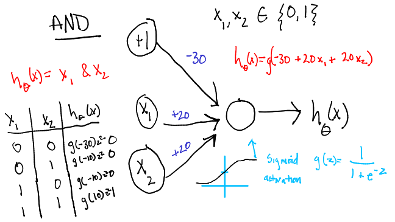

# Overview of Learning

## Supervised vs Unsupervised Learning

### **Supervised**: What we know --------> MODEL --------> What we want to know

* All data is labeled
* Learning from data can be thought of as a teacher supervising learning
* We know the correct answer
* Learning stops when the model is able to accurately model the patterns in the data
* Used for: classification(dog?cat?airplane?) or regression(housing price? temperature?)

### **Un-supervised**: What we know --------> MODEL --------> Patterns found in data

* Only have input data (X) and no corresponding output data
* Goal is to model the underlying structure of the data to learn more about it
* No teacher
* We don't know the correct answers
* Learning is up to the algorithm. It stops when the algorithm is able to discover an interesting structure in the data.
* Used for: clustering(how many labels?) or association(where does X go?)

#### There's also semi-supervised that is a mix of these two

## Reinforcement Learning(RL)

When it is not in our power to determine what is true, we ought to act in accordance with what is most probable. - Descartes

* Unsupervised learning: That thing is like this other thing. 
    - (The algorithms learn similarities w/o names, and by extension they can spot the inverse and perform anomaly detection by recognizing what is unusual or dissimilar)
* Supervised learning: That thing is a “double bacon cheese burger”.
    - (Labels, putting names to faces…) These algorithms learn the correlations between data instances and their labels; that is, they require a labelled dataset. Those labels are used to “supervise” and correct the algorithm as it makes wrong guesses when predicting labels.
* Reinforcement learning: Eat that thing because it tastes good and will keep you alive longer.
    - (Actions based on short- and long-term rewards, such as the amount of calories you ingest, or the length of time you survive.) Reinforcement learning can be thought of as supervised learning in an environment of sparse feedback.

source: https://deeplearning4j.org/deepreinforcementlearning

# What's a nueral network (supervised model)?

A neural network defines a mapping **y = f(x)** given some parameters **weights** that results in a _universal_ **function approximator**. In other words, the goal of a neural network is to discover a mapping(**f**) between some input(**x**) and the desired output(**y**). For the most part, in Deep Learning(DL), we aren't interested in the form of the function that we're learning, only that it makes accurate predictions. This is the **black box** approach. If we're interested in the inner workings of the function then we can use simpler algorithms(like shallow Machine Learning(ML)).

In our training data, we have **x** (e.g. pixels, house price, words) that directly specify a label **y** (e.g. cat/dog/bear/etc., $, yes/no). We are _directly_ telling the model that if we give it **x** we want it to predict **y**.

## Why do we need a function approximator?

In our data, we have a dataset with inputs(**x**) and outputs(**x**). It may be a simple task to model the correlation between the two (X -> Y) such that we can create a function lik a linear model(y = mx + b). But, what if the correlation isn't obvious? A Neural Network(NN) will search for correlation between the inputs and outputs. However, what if the inputs don't directly correctly with the outputs? Then we can add "intermediate datasets" or intermediate **features** that themselves help learn to model the correlation. These intermediate "datasets" are the **hidden layers** (more on this later).

In other words, an image of a dog is composed of pixels but no one pixel determines whether it's a picture of a dog or not. As humans, we're able to pick up on **patterns** in the image (i.e. **configurations of pixels**) that help us identify a dog. These **combinations** of pixels could be ears, nose, eyes, etc. Overall, at each layer the model is building these configurations to help it in the next layer. So we start simple then go to complex configurations which are built on the previous ones(there's feature hierarchy of sorts). The final output layer then is able to take these complex configurations(eyes, nose, hair) to predict whether there's a dog or not.

### Key takeaways: 
* NN is a function approximator using generalized statistics
* **x** = inputs = information (what we know)
* **y** = outputs = predictions (what we want to know)
* **weights** = learned knowledge
* **The NN learns correlation between input and output.**
* The NN gets **new features** at different layers. **It doesn't need to just deal with raw features**.

## What is it made of?

A neural network is composed of **layers**. A **layer** is a collection of **neurons**. A typical NN will be composed of an **input layer**, **hidden layer(s)**, and an **output layer**.

For the input layer, each **features** corresponds to a nueron in the layer. For example, one **x** could be [ age, weight, height] so we have 3 nuerons each corresponding to age, weight, and height features. Alternatively, we can think of a grayscale 25 x 25 image where each pixel is a nueron. Therefore we have (25 * 25) = 625 neurons in the input layer.

### What are these lines coming out of the neurons at each layer?

Each **neuron** is trying to correctly predict the output(**y**) given the input (**x**). Keep in mind that each neuron is trying to learn something unique. That is, each neuron accounts for a portion of the correlation between input(**x**) and output(**y**). But the neurons in the hidden layer don't know which inputs are helpful so every neuron in the previous layer is connected to each nueron in the next layer (**fully connected**).

So each nueron is connected to the previous layers neurons but we still don't know **how much** a nueron will help model some correlation. That's where the **weights** come into play. The **weights** control the mapping from layer j to layer j + 1. That is, the weights control how much correlation the given nueron(input) contributes to the prediction(output). Weights are usually values between 0 and 1 so a weight closer to 1 means that the input can contribute strongly while a 0 means it contributing nothing(noise).

In general, you can think of the **weights** as knobs that need to be **tuned** to model the patterns in the data. The training in large part is about **tuning** these knobs to the "correct" value.

### How do we tune the knobs?

Math (**gradient descent**). In short, we can calculate a relationship between the weights and error for the entire model. That is, if we feed in **X** we get this much error with the given **weights/knobs**. We can calculate the error because we already know our desired output so we can quanitfy what our model is predicting vs what the actual value is.

Now, our goal is to reduce that error to the lowest possible value by changing the weights. How? Do we increase the value or decrease and by how much? The function that calculates the error helps us: we can calculate a direction(**increase/decrease** or **up/down**) and a slope(**scale**).

Notice however, that the error that's calculated describes a relationship between the inputs and outputs. The error is **shared** accross all weights. Therefore, for each weight we calculated a direction and slope that tells us **how much this particulare weight contributed to the error**. We are **attributing** the error to the weights that are responsible for the error and **tuning* them.

As the nuerons are learning, they absorb some of the **error** to better model some of the **correlation** found in the data(patterns).

## Where does the term "deep" come from?

A network can be composed of multiple layers(**hidden layers**) that lie inbetween the input layer and the output layer. The more hidden layers, the deeper the input data must be feed through the network.

For the most part, what these hidden layers are used for is not specified by the training data (X <-> Y). We are essentially creating the building blocks for the algorithm, giving it training data, and specifiying the desired output, therefore the learning algorithm **must decide how to use the hidden layers** to approximate the **f(x)**.

#### Why are they called "hidden layers"?

Outside of the output layer, the training data doesn't "show" the desired output(**y**) to the layers.

## The neuron (perceptron)

Perceptrons have been around since the 1950s and these are the building blocks of neural networks.

A perceptron takes in **binary(0 or 1)** inputs and produces a **binary(yes/no)** output.

A perceptron produces linear halfplanes => the data is **linearly separable**:

What if it's not linearly separable? That's where the nueral networks come into play.

* [Blog post](http://sebastianraschka.com/Articles/2015_singlelayer_neurons.html#the-perceptron-learning-rule) about going from single perceptron learning to gradient descent learning
* [Perceptron in python](https://maviccprp.github.io/a-perceptron-in-just-a-few-lines-of-python-code/)
